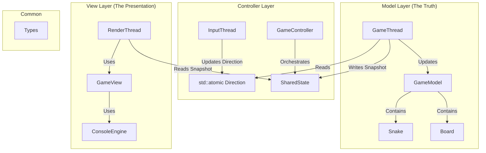
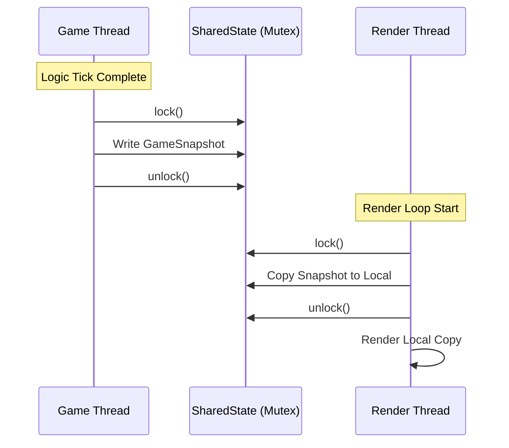

Design Document: Multi-Threaded Snake Engine
-

**1. Introduction**

The goal of this project is to implement high-performance, decoupled Snake game in C++. Unlike traditional single-threaded implementations,
this engine utilizes a multi-threaded architecture to separate game logic, input processing, and rendering.
This ensures that the rendering loop remains fluid and independent of the game's internal tick rate.

**2. Architectural Pattern (MVC)**

The project follows the Model-View-Controller (MVC) design pattern, augmented with dedicated Engine layer for hardware abstraction


**3. Threading & Concurrency Model**

The engine operates using three distinct, decoupled threads:
1. **Input Thread (Blocking)** : Listens for raw keyboard input via the ```ConsoleEngine```. It updates a `std::atomic<Direction>` value.
Using `std::atomic` allows the input thread to communicate with the Game thread without overhead of a mutex.
2. **Game Thread(Fixed Tick)** : Runs on a high-precision timer (150ms). It processes physics, collision detection, and snake growth.
Upon completion of a tick, it generates a `GameSnapShot`.
3. **Render Thread(Free-running)** : Runs as fast as the system allows (or a capped FPS). It does not know the `GameModel` exists; 
it only knows the `GameSnapShot`.

**Synchronization Strategy: The Snapshot Pattern**

To avoid long-held locks that would stall the rendering, Snapshot pattern is implemented:

- **The Problem**: Locking the entire ```GameModel``` during a render would cause the Game Thread to wait for the Renderer to finish drawing.
- **The Solution**: The ```GameThread``` locks a mutex only long enough to copy the current state into a lightweight ```GameSnapshot``` struct. The RenderThread then locks the mutex only long enough to copy that snapshot to its local memory
- **Complexity**: Lock duration is O(1) relatively to the game complexity.



**4. Key Engineering Decisions (Trade-offs)**

### Engineering Trade-offs & Design Decisions

| Design Decision | Alternative Considered | Rationale & Trade-offs |
| :--- | :--- | :--- |
| `std::atomic<Direction>` | `std::mutex` | `Direction` is a small, trivial type. Atomic operations provide much lower latency and prevent the Input thread from ever being blocked by the Game thread. |
| `std::deque` for Snake Body | `std::vector` | Snake movement involves adding a head and removing a tail. `std::deque` provides $O(1)$ complexity for both ends, whereas `std::vector` would require $O(n)$ for erasing the front. |
| **Snapshot Pattern** | Shared Pointer to Model | Sharing the Model via pointer creates a massive bottleneck where the Renderer and Game Logic fight for the same lock. Snapshots prioritize "Smooth Rendering" over "Minimal Memory Usage." |
| `ConsoleEngine` Abstraction | Direct `std::cin` | By abstracting terminal I/O, the core game logic remains platform-agnostic. The engine could theoretically be swapped for an SDL or SFML engine without touching the `GameModel`. |


**5. Complexity Analysis**

### Complexity
| Operation | Data Structure | Time Complexity | Space Complexity |
| :--- | :---: | ---: | ---: |
| Snake Move | `std::deque` | $O(1)$ | $O(1)$ |
| Food Spawning | `Random Engine` | $O(1)$ | $O(1)$ |
| Collision Check | `Board Grid` | $O(1)$ | $O(1)$ |
| Game Reset | `Full Re-init` | $O(N)$ | $O(N)$ |
