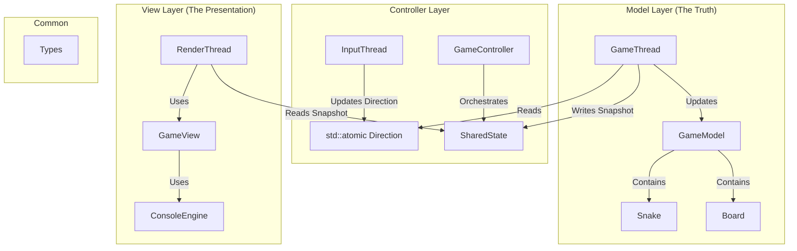
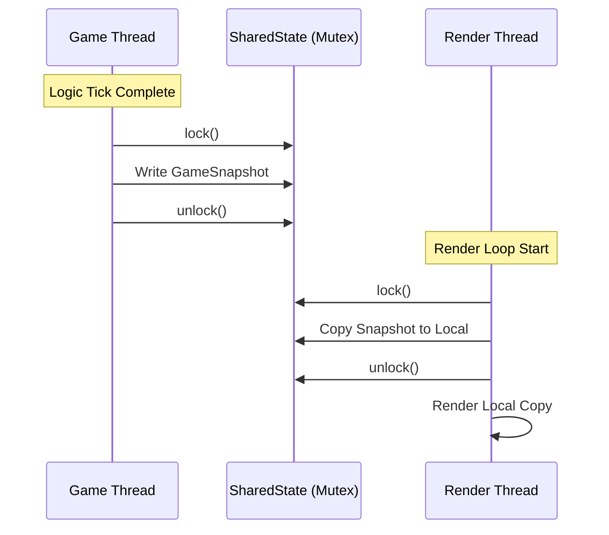

# Design Document: Multi-Threaded Snake Engine

---

## 1. Introduction

The goal of this project is to implement a high-performance, decoupled Snake game in C++. Unlike traditional single-threaded implementations, this engine utilizes a multi-threaded architecture to separate game logic, input processing, and rendering. This ensures that the rendering loop remains fluid and independent of the game's internal tick rate.

Three threads represent the minimum viable decomposition for this architecture. Adding more threads would introduce additional synchronization overhead without clear throughput gains at this scale.

---

## 2. Architectural Pattern (MVC)

The project follows the Model-View-Controller (MVC) design pattern, augmented with a dedicated Engine layer for hardware abstraction.



---

## 3. Threading & Concurrency Model

The engine operates using three distinct, decoupled threads:

1. **Input Thread (Blocking):** Listens for raw keyboard input via `ConsoleEngine`. It updates a `std::atomic<Direction>` value. Using `std::atomic` allows the Input Thread to communicate with the Game Thread without the overhead of a mutex.

2. **Game Thread (Fixed Tick):** Runs on a high-precision timer (`TICK_MS = 150ms`, targeting ~6.7 ticks/sec — conventional Snake pacing). It processes physics, collision detection, and snake growth. Upon completion of each tick, it generates a `GameSnapshot`.

3. **Render Thread (Free-running / FPS-capped):** Runs at a configurable target FPS. It does not busy-wait; instead it sleeps via `std::this_thread::sleep_for` between frames to avoid unnecessary CPU burn. It has no knowledge of `GameModel` — it only reads `GameSnapshot`.

### Synchronization Strategy: The Snapshot Pattern

To avoid long-held locks that would stall rendering, a Snapshot pattern is implemented:

- **The Problem:** Locking the entire `GameModel` during a render would cause the Game Thread to wait for the Renderer to finish drawing.
- **The Solution:** The Game Thread locks a mutex only long enough to copy the current state into a lightweight `GameSnapshot` struct. The Render Thread then locks the mutex only long enough to copy that snapshot to local memory.
- **Complexity:** Lock duration is $O(1)$ relative to game complexity.



### SharedState Structure

`SharedState` is the single shared object between the Game and Render threads:

```cpp
struct SharedState {
    std::mutex mtx;
    GameSnapshot snapshot;
};
```

### GameSnapshot Structure

`GameSnapshot` is a lightweight, copyable struct representing everything the Render Thread needs to draw a frame:

```cpp
struct GameSnapshot {
    std::deque<Point>  snakeBody;   // Ordered head-to-tail
    Point              foodPos;
    int                score;
    GameState          state;       // RUNNING, PAUSED, GAME_OVER
};
```

---

## 4. Thread Lifecycle

Threads must be initialized and torn down in a defined order to prevent reads from stale or uninitialized state.

### Startup Order

| Step | Action |
| :--- | :--- |
| 1 | `ConsoleEngine` initialized on main thread |
| 2 | `SharedState` and `GameModel` constructed |
| 3 | Input Thread launched — begins blocking on keyboard |
| 4 | Game Thread launched — writes first `GameSnapshot` after tick 0 |
| 5 | Render Thread launched — waits for first valid `GameSnapshot` before drawing |

### Shutdown Order

Shutdown is coordinated via a shared `std::atomic<bool> running`. Threads are joined in **reverse startup order** to ensure no thread reads from a producer that has already stopped:

```cpp
std::atomic<bool> running{true};

// On quit signal:
running = false;
renderThread.join();   // First: stop reading
gameThread.join();     // Then: stop writing snapshots
inputThread.join();    // Last: stop updating direction
```

---

## 5. Key Engineering Decisions (Trade-offs)

| Design Decision | Alternative Considered | Rationale & Trade-offs |
| :--- | :--- | :--- |
| `std::atomic<Direction>` | `std::mutex` | `Direction` is a small, trivial type. Atomic operations provide much lower latency and prevent the Input Thread from ever being blocked by the Game Thread. |
| `std::mutex` for SharedState | `std::shared_mutex` | A `shared_mutex` would allow concurrent readers. However, because the Snapshot pattern keeps lock duration near-zero, the added complexity of `shared_mutex` yields no measurable benefit. Plain `mutex` is simpler and sufficient. |
| `std::deque` for Snake Body | `std::vector` | Snake movement involves adding a head and removing a tail. `std::deque` provides $O(1)$ complexity for both ends, whereas `std::vector` would require $O(n)$ for erasing the front. |
| **Snapshot Pattern** | Shared Pointer to Model | Sharing the Model via pointer creates a bottleneck where the Renderer and Game Logic contend for the same lock. Snapshots prioritize smooth rendering over minimal memory usage. |
| `ConsoleEngine` Abstraction | Direct `std::cin` | By abstracting terminal I/O, core game logic remains platform-agnostic. The engine could be swapped for an SDL or SFML backend without touching `GameModel`. |
| Fixed 150ms tick (`TICK_MS`) | Dynamic tick rate | 150ms (~6.7 ticks/sec) is conventional Snake pacing. It is exposed as a named constant and can be tuned without touching logic code. |

---

## 6. Data Structures & Algorithms

### Complexity Analysis

| Operation | Data Structure | Time Complexity | Space Complexity |
| :--- | :---: |----------------:|-----------------:|
| Snake Move | `std::deque` |          $O$(1) |           $O$(1) |
| Food Spawning | Random Engine |          $O$(1) |           $O$(1) |
| Collision Check | Board Grid |          $O$(1) |           $O$(1) |
| Game Reset | Full Re-init |          $O$(N) |           $O$(N) |

†See Food Spawning note below.

### Collision Detection

The `Board` maintains a 2D array of cell types (`EMPTY`, `SNAKE`, `FOOD`, `WALL`). Wall and self-collision checks are therefore $O(1)$ index lookups rather than $O(N)$ linear scans of the snake body. The snake body updates this grid in $O(1)$ per move by marking the new head cell and clearing the vacated tail cell.

### Food Spawning

Food is placed on a randomly selected empty cell. In the degenerate case where the snake fills most of the board, repeated random sampling degrades. A retry loop with a bounded attempt count guards against this; if attempts are exhausted, the game can fall back to a linear scan for the first available cell.

```cpp
Point spawnFood() {
    for (int attempt = 0; attempt < MAX_SPAWN_ATTEMPTS; ++attempt) {
        Point candidate = randomCell();
        if (board.cellAt(candidate) == CellType::EMPTY)
            return candidate;
    }
    return board.firstEmptyCell(); // O(N) fallback
}
```

---

## 7. Error Handling & Edge Cases

| Scenario | Handling Strategy |
| :--- | :--- |
| Food spawns on snake (full board) | Retry loop with `O(N)` fallback scan |
| Render Thread starts before first Snapshot | Render Thread checks `snapshot.state` validity before drawing |
| Thread exception during game loop | `running = false` set in catch block; all threads join cleanly |
| Input received during `GAME_OVER` | `GameThread` discards direction updates until reset |