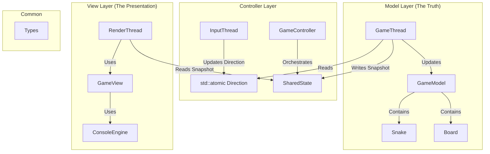
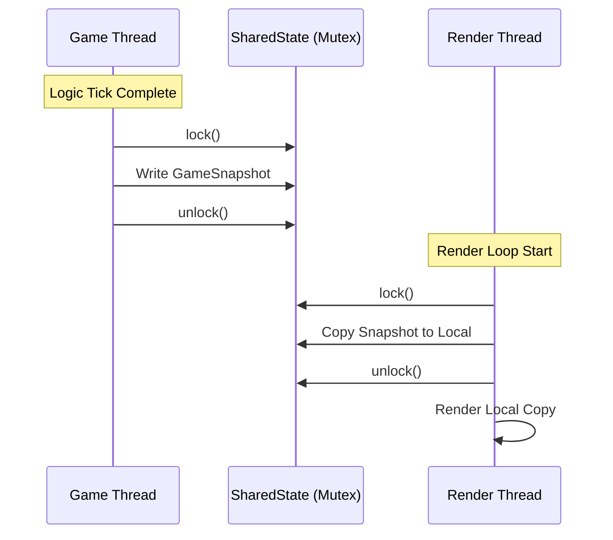

Design Document: Multi-Threaded Snake Engine
-

**1. Introduction**

The goal of this project is to implement high-performance, decoupled Snake game in C++. Unlike traditional single-threaded implementations,
this engine utilizes a multi-threaded architecture to separate game logic, input processing, and rendering.
This ensures that the rendering loop remains fluid and independent of the game's internal tick rate.

**2. Architectural Pattern (MVC)**

The project follows the Model-View-Controller (MVC) design pattern, augmented with dedicated Engine layer for hardware abstraction

**3. Threading & Concurrency Model**

The engine operates using three distinct, decoupled threads:
1. **Input Thread (Blocking)** : Listens for raw keyboard input via the ConsoleEngine. It updates a std::atomic<Direction> value.
Using std::atomic allows the input thread to communicate with the Game thread without overhead of a mutex.
2. **Game Thread(Fixed Tick)** : Runs on a high-precision timer (150ms). It processes physics, collision detection, and snake growth.
Upon completion of a tick, it generates a GameSnapShot.
3. **Render Thread(Free-running)** : Runs as fast as the system allows (or a capped FPS). It does not know the GameModel exists; 
it only knows the GameSnapShot.

**Synchronization Strategy: The Snapshot Pattern**

To avoid long-held locks that would stall the rendering, Snapshot pattern is implemented:

- **The Problem**: Locking the entire GameModel during a render would cause the Game Thread to wait for the Renderer to finish drawing.
- **The Solution**: The GameThread locks a mutex only long enough to copy the current state into a lightweight GameSnapshot struct. The RenderThread then locks the mutex only long enough to copy that snapshot to its local memory
- **Complexity**: Lock duration is O(1) relatively to the game complexity.

